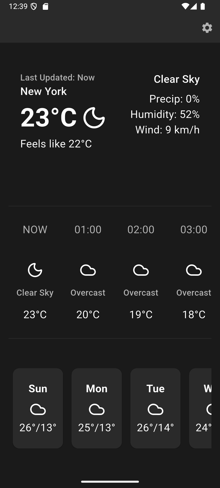
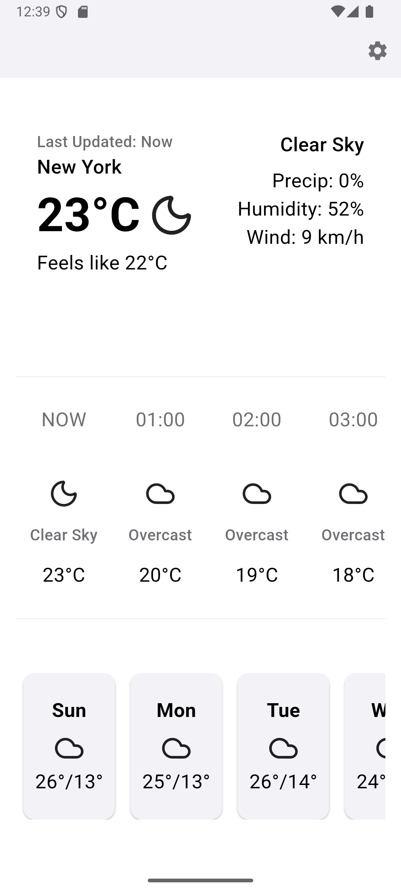
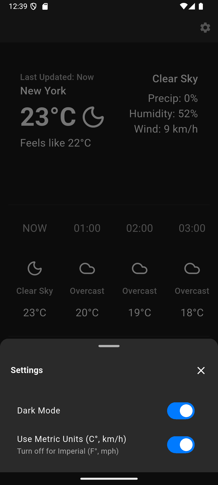

# Clear Weather


A clean, minimalist weather app built with Flutter. Get accurate hourly and daily forecasts, location-based updates, and a beautiful, modern UI.

## Features

- **Current Weather**: See real-time weather conditions for your location
- **Hourly & Daily Forecasts**: Detailed forecasts for the next hours and days
- **Location-Based Updates**: Weather data updates automatically based on your location
- **Offline Caching**: Access recent weather data even without internet
- **Dark/Light Theme**: Switch between dark and light modes
- **Settings**: Customize your experience
- **Material Design 3**: Modern, clean UI following Material Design principles
 - **Theme Switching**: Instantly toggle between dark and light modes from the settings screen
 - **Responsive Design**: Looks great on all screen sizes and devices

## Screenshots


<p align="center">
	
	
	
</p>

## Tech Stack

- **Framework**: Flutter 3.35.1
- **State Management**: Riverpod
- **Networking**: Dio
- **Location**: Geolocator
- **UI**: Material Design 3
- **Architecture**: Clean, modular structure with providers and services

## Getting Started

### Prerequisites
- Flutter SDK (3.35.1 or higher)
- Dart SDK
- Android Studio / VS Code

### Installation

1. **Clone the repository**
	```bash
	git clone <your-repo-url>
	cd clear_weather
	```

2. **Install dependencies**
	```bash
	flutter pub get
	```

3. **Run the app**
	```bash
	flutter run
	```

## Building for Release

### Android APK
```bash
flutter build apk --release
```

### Android App Bundle (for Play Store)
```bash
flutter build appbundle --release
```

## Project Structure

```
lib/
├── constants/        # Color schemes and constants
├── data/             # Services, repositories, exceptions
├── models/           # Data models
├── pages/            # UI screens
├── providers/        # State management
├── theme/            # App-wide theme configuration
├── utils/            # Utility functions
└── widgets/          # Reusable UI components
```

## Contributing

1. Fork the project
2. Create your feature branch (`git checkout -b feature/AmazingFeature`)
3. Commit your changes (`git commit -m 'Add some AmazingFeature'`)
4. Push to the branch (`git push origin feature/AmazingFeature`)
5. Open a Pull Request

## License

This project is licensed under the MIT License - see the [LICENSE](LICENSE) file for details.

## Acknowledgments

- Built with Flutter
- Weather data powered by Open-Meteo
- Icons from Material Design
- Inspired by clean, minimalist design principles

---

**Made by Stevie**
